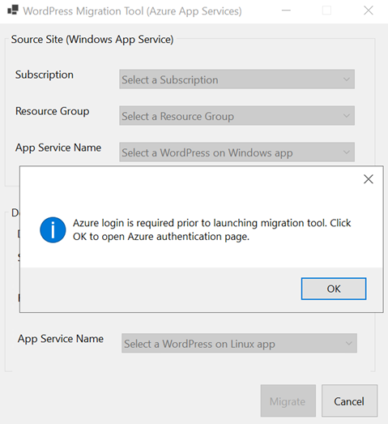
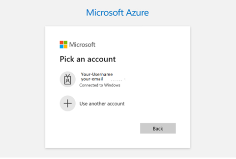
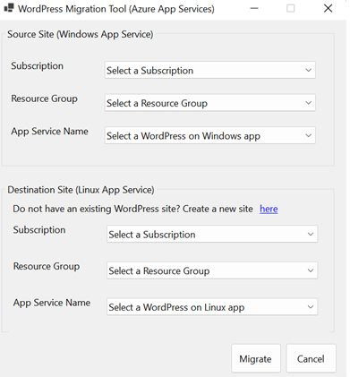
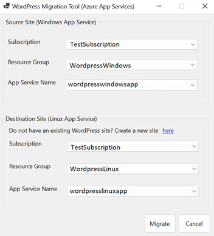
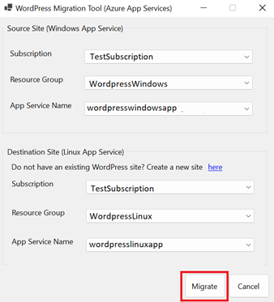

# WordPress Migration to Linux App Service

This document describes Tool that you can use to migrate your WordPress sites running Windows App Services to WordPress deployed to Linux App Services, preferably created from [Azure Market Place](https://aka.ms/linux-wordpress). These migration approaches will let you continue with the existing WordPress site as it is. It is recommended to transition the traffic to the new site after all the validations are taken place, site is successfully up and running.

**Note:** Migrate the content to a test instance first, validate all E2E scenarios of your website, and if everything works as expected, swap this instance to the production slot.

Automated Migrations allows you to easily migrate your WordPress site to Linux App Service platform. All you need to do is provide the tool your Source site details(subscription, resource group & App Name) & Destination site details(subscription, resource group & app name) and let the tool do all the heavy lifting.

**Before Migrating:**
1.Create a new WordPress site from marketplace offering: [Azure Market Place](https://aka.ms/linux-wordpress) to migrate your existing website to
2.Make sure you have access permissions to the subscriptions & apps for both existing & new sites

## WordPress Migration Tool

WordPress migration tool for app services is a one-click service to migrate a WordPress on Windows Azure App Service to a WordPress on Linux App Service. Download the WordPressMigrationTool.zip from [this link](https://aka.ms/WPmigration) to your local machine and extract the zip file.

**Prerequisites to launch the exe:**

Visual Studio with .NET6 package installed.
Migrate WordPress site from Windows to Linux app service:

## Migration Process

1.To start a migration, run the exe from above extracted zip file. You will be prompted to allow azure authentication for the migration tool. Clicking the Ok button will redirect you to azure authentication page in the default browser.

    

2.Select an existing account or add a new user account.
    

3.The migration tool waits for authentication for 30 seconds before continuing.
        

4.Select the subscription, resource group and app name for a WordPress on Windows site.
        

5.If you do not have a target WordPress on Linux app already deployed, follow this link to create Linux site. After creating the site, come back to this step to continue the Migration.
        

6.Select subscription, resource group and app name for the target WordPress on Linux site.
        

7.Click the Migrate button to begin migration.
        

8.Below screen is loaded displaying the  migration logs in real time:  
        

9.The following prompt appears when migration is completed.
        

If the Migration encounters any issues with the information you have entered, you will be directed back to the migration form to correct the specified details.

Once the physical migration has completed you will want to perform the following post migration steps as described below.

## Post Migration Actions

### Install Recommended Plugins

It is an optional step, after the site migration it is recommended to validate that you have the default recommended/equivalent plugins activated and configured accurate as before. If you are prohibited from not configuring them as per your organization governing policies, then you can uninstall the plugins.

- The W3TC plugin should be activated and configured properly to use the local Redis cache server and Azure CDN/Blob Storage (if it was configured to use them originally). For more information on how to configure these, please refer to the following documentations:

  - [Local Redis Cache](./wordpress_local_redis_cache.md)
  - [Azure CDN](./wordpress_azure_cdn.md)
  - [Azure Blob Storage](./wordpress_azure_blob_storage.md)

- WP Smush plugin is activated and configured properly for image optimization. Please see [Image Compression](./wordpress_image_compression.md) for more information on configuration.

### Recommended WordPress Settings

The following WordPress settings are recommended. However, when the users migrate their custom sites, is it up to them to decide whether to use these settings or not.

1. Open the WordPress Admin dashboard.
2. Set the permalink structure to 'day and name', as it performs better compared to the plain permalinks that uses the format **?p=123**.
3. Under the comment settings, enable the option to break comments into pages.
4. Show excerpts instead of the full post in the feed.

## Search And Replace (paths and domains)

One common issue that users face during migration is that some of the contents of their old site use absolute urls/paths instead of relative ones. To resolve this issue, you can use plugins like [Search and Replace](https://wordpress.org/plugins/search-replace/) to update the database records.

## Configuring Custom Domain

If you plan to setup your site with a new Custom Domain please follow the steps described here: Tutorial: [Map existing custom DNS name - Azure App Service | Microsoft Docs](https://docs.microsoft.com/azure/app-service/app-service-web-tutorial-custom-domain?tabs=a%2Cazurecli)

## Migrating Custom Domain

When you migrate a live site and its DNS domain name to App Service, that DNS name is already serving live traffic. You can avoid downtime in DNS resolution during the migration by binding the active DNS name to your App Service app pre-emptively as per the steps described here: [Migrate an active DNS name - Azure App Service | Microsoft Docs](https://docs.microsoft.com/azure/app-service/manage-custom-dns-migrate-domain)

## Updating SSL Certificates

If your site is configured with SSL certs, then we need to redo the setup following the instructions here: [Add and manage TLS/SSL certificates - Azure App Service | Microsoft Docs](https://docs.microsoft.com/azure/app-service/configure-ssl-certificate?tabs=apex%2Cportal)
