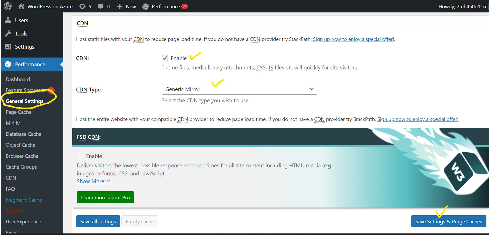
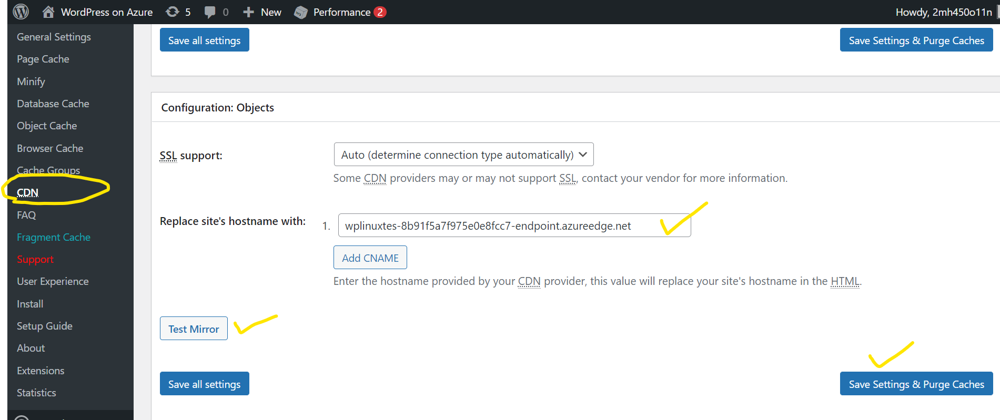

# Configuring Azure CDN with WordPress

This document describes configuring Azure CDN with your WordPress site under the assumption that your site is already configured with W3Total Cache plugin and activated. If your site is using a different caching plugin than W3Total Cache, then the recommendation is to follow through the steps according to the specific plugin guidelines. 

**Azure Content Delivery Network (CDN)** offers a global solution for rapidly delivering high-bandwidth content to users by caching their content at strategically placed physical nodes across the world. It can  help in enhancing the performance of the WordPress application by serving static files such as images, js, css through its global endpoint. This also help in significantly reducing the load on the web server.

For Linux WordPress offering, a new Azure CDN profile and an endpoint is created using the **Azure CDN Standard from Microsoft** product ([Compare Azure CDN Products](https://docs.microsoft.com/azure/cdn/cdn-features?toc=/azure/frontdoor/TOC.json)).  The CDN endpoint is then configured in WordPress using **W3 Total Cache** plugin and it's setting can be seen in the CDN tab of plugin's settings. Please note that it usually takes up to **15 minutes** for the CDN to show up and get configured in WordPress, after the deployment of App Service.

The following Application Settings used at deployment time to configure WordPress to use the CDN endpoint. These settings are only used as a 'one-time' reference during the deployment time. For more information see [WordPress Application Settings](./wordpress_application_settings.md).

|Application Settings | Value |
|---------------------|-------|
|CDN_ENABLED | true/false     |
|CDN_ENDPOINT | cdn endpoint url   |

If the CDN is not installed as part of your site deployment and would like to enable it now, then navigate to WP-Admin dashboard and modify the settings as described below.

**Note:** The local cache in W3TC plugin should be purged after the configuration changes.

 From WordPress Admin dashboard, navigate to Performance blade as shown in the below screenshot:

Select General settings under Performance blade, navigated to CDN section in General Settings and modify the values as described in this screenshot and save the configuration:

Select CDN blade in left navigation bar, specify the CDN endpoint as shown in the below screenshot and save the settings.

Now your Wordpress site is all set with CDN and can observe the improvement in your page response time.

## Learn More

- [Compare Azure CDN products](https://docs.microsoft.com/azure/cdn/cdn-features?toc=/azure/frontdoor/TOC.json)
- [What is a content delivery network on Azure?](https://docs.microsoft.com/azure/cdn/cdn-overview?toc=/azure/frontdoor/TOC.json)
- [W3 Total Cache – WordPress plugin | WordPress.org](https://wordpress.org/plugins/w3-total-cache/)
