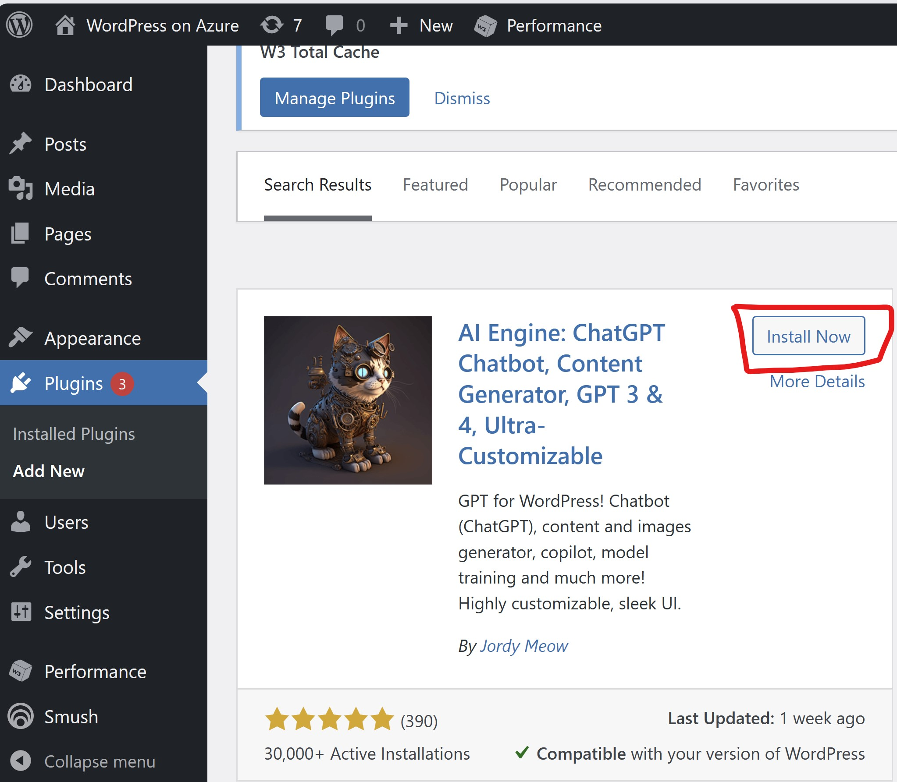
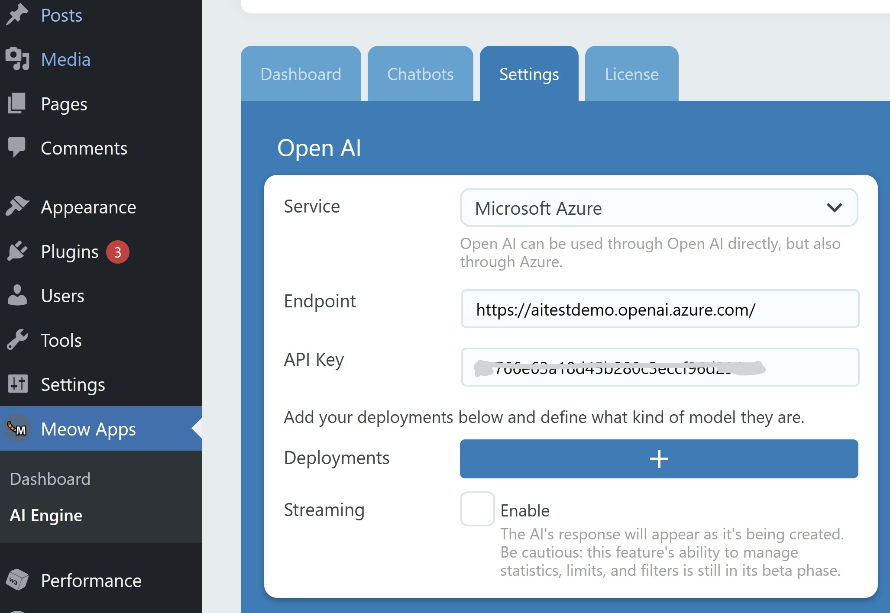

# WordPress on Azure App Service – Simplify site creation with Azure OpenAI

AI models can provide significant benefits to WordPress content generation by analysing vast amounts of data and generate high-quality content automatically. This can save content creators time and effort by automating repetitive and time-consuming tasks such as keyword research, topic selection, writing blog drafts or image generation.

This document explains how to configure Azure Open AI with WordPress on Azure AppService. With this integration you can enable:

    1. Content/ Posts creation and generation 
    2. Translation of the content the language of your choice
    3. Content proof reading/ polishing the content for grammatical correctness 
    4. Image Generation based on the subject/topic
    5. Search and navigation within website
    6. Chatbots and customer support

**Prerequisite**:  Create Azure Open AI resource from Azure Portal

1. In Azure Portal – navigate to Create resource and search for Open AI resource
2. Follow the steps described in [Create Open AI resource](https://learn.microsoft.com/en-us/azure/ai-services/openai/how-to/create-resource?pivots=web-portal). The screen looks as follows:
   
   

**Deploy Azure OpenAI models**

Deploy the desired AI model following the steps described in “Deploy a model” section of this document [How-to - Create a resource and deploy a model using Azure OpenAI Service](https://learn.microsoft.com/en-us/azure/ai-services/openai/how-to/create-resource?pivots=web-portal)

  *Note: It is recommended to deploy a gpt-35-turbo model.*

Chose the GPT model (Davinci, Curie, Babage, Ada, gpt-35-turbo, DALL-E) as per your needs explained here [Azure OpenAI Service models](https://learn.microsoft.com/en-us/azure/ai-services/openai/concepts/models#model-summary-table-and-region-availability).  

Different models have different capabilities and pricing. Checkout [pricing](https://azure.microsoft.com/en-us/pricing/details/cognitive-services/openai-service/), [model](https://learn.microsoft.com/en-us/azure/ai-services/openai/concepts/models#working-with-models) description and decide your option.

## Configure Azure OpenAI with WordPress on App Service 
 
To configure Azure OpenAI models with WordPress on App Service, you can install and activate the AI Engine plugin from WordPress marketplace for plugins 

1. Launch WordPress Admin dashboard and install the AI Engine plugin :
   
   

3. Once the plugin is installed and activated, Meow Apps is shown in the right bar as shown below:
   

5. Go to AI Engine. In the Dashboard screen you can add multiple models. Chose Chatbot, Generators(Content & Image), Playground.
   

7. Go to Settings tab, configure Endpoint & API Key of your Azure OpenAI resource
   
 

Note: Endpoint & API Key to be captured from your Azure Open AI resource definition created in the first step in Azure portal as shown in below screenshot.

 

You can now leverage the AI capabilities – Chatbot, Content & Image creation offered by Azure OpenAI. See below for more information about its capabilities: 

**Chatbot (GPT-like)**: Enhance your website with a chatbot powered by AI, similar to GPT models. It includes an image bot, a shortcode builder, and offers a wide range of customizable parameters and possibilities.  
 
NOTE: When using chatbot, it is essential to select the desired model to be used as shown below. By default, the AI Engine plugin automatically selects the turbo model; however, it is necessary to modify this setting if you wish to utilize other models. 

 

You can find the 'Generate Content', 'Generate Images' and 'Playground' tools  in Tools section of WordPress dashboard as shown 

|  |

*Content & Images Generator**: Generate fresh and engaging content for your website, along with high-quality images, using AI algorithms.  
 
*AI Playground*: Explore a variety of AI tools within the plugin, such as translation, correction, and engaging in discussions, providing a versatile AI-powered playground.  
 
*Templates System*: Create customized templates for the AI Playground, Content Generator, and Image Generator, allowing you to tailor the AI experience to your specific needs.  
 
*AI Copilot*: Seamlessly integrate AI capabilities directly into your website editor, enabling you to leverage AI assistance while creating content or managing your website.  

*Quick Suggestions*: Obtain one-click recommendations for titles, excerpts, and other elements, making it effortless to apply AI-generated suggestions and enhance your website's content. |

## Few example steps for generating images, content and posts
**Generate Images**:  From WP Admin dashboard side bar, click on Generate Images section. Type the text for which you need image, no. of images and click on Generate Image as shown below

**Generate Content**: From the Admin side bar, click on Generate Content section. Type title, choose the Language, writing Style, writing Tone and click on Generate as shown in the below screen: 

When creating a post/page, you can access AI-Copilot by entering space in a Block and generate Titles and Excerpts as shown below: 

