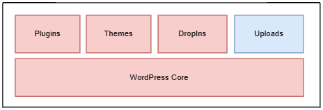

# Enabling High Performance With Local Storage

A relatively common problem with WordPress is that the Admin dashboard has slow performance even when the frontend works fast for the users. Most of the performance enhancements ([Azure CDN](https://learn.microsoft.com/en-us/azure/cdn/cdn-overview), [Azure Blob Storage](https://learn.microsoft.com/en-us/azure/storage/blobs/storage-blobs-overview)) are limited to speeding up your frontend and do not improve the performance of your Admin dashboard. And this makes managing your website challenging. In this article, we will learn about how we can improve the performance of Admin dashboard. 

### How does this work?

By default, Azure App Service stores your files on a persitent remote file server. Now you can configure your WordPress to use the local storage. This improves the performance significantly because the requests are now served from local storage. During container startup time, the files are copied from remote storage to local storage. Any changes made on the local storage are immediately and asynchronously written back to the remote file server.

It is very important to note that only the part of WordPress that highly impacts the performance is moved to the local storage. This mostly includes **WordPress Core Code + Plugins + Themes + Dropins**. Moreover, local storage is limited in size and therfore, we only move the necessary data. The user uploaded static content (under **wp-content/uploads/**) is always kept on the remote file server and is never moved to local storage. Therefore any user uploaded static data is directly written to remote file storage.

It might take a few minutes for the files to be copied to local storage asynchronously. The actual time, however, would depend on the size of your WordPress site. For instance, a very large site with ~40k files might take around 10 minutes to transfer. This operation might initially slow down your site, but once the files are transfered, the performance would be super fast.

### How to enable this feature?
Go to your App Service and add the following Application Setting, and then wait for your App to restart. It might take around few minutes for this feature to function fully.

|Application Setting |Value     |
| :---------------------------------------| :----------|
|WORDPRESS_LOCAL_STORAGE_CACHE_ENABLED |true      |

### Limitations
- **Scaling out** of App Service is not supported when this feature is enabled. This application setting only works for single node applications. Should you need more computing power to meet your requirements, you can always **Scale Up**.

- It might take few mintues for this feature to fully function after your App starts. This is because files are copied from remote storage to local storage asynchronously. The actual time, however, would depend on the size of your site. For instance, a very large site with ~40k files might take around 10 minutes to transfer. This operation might initially slow down your site, but once the files are copied, the performance would be super fast.

- This feature is enabled only if the total size of your site excluding the user uploaded content under **wp-content/uploads**, is less than 10GiB. This limit is more than enough to accommodate **WordPress Core Code + Plugins + Themes**. This restriction has been placed because local storage is limited in size. If the size exceeds the above limit, the feature is not enabled and the Web App uses the remote file server.

### Recommendations
- Always remove unused plugins and themes, as it might impact the initialization time of the feature.
- Do not stop/re-start the site immediately after adding some plugins/themes. Wait for few minutes before doing so. Since files are copied asynchronously to the remote storage, sometimes there can be a network delay in transfering the files.
