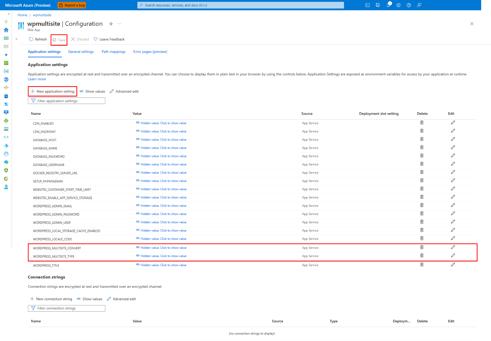

# How to enable Multisite WordPress on Azure App Service?

WordPress Multisite is a feature of WordPress that enables you to create and manage multiple websites within a single WordPress installation. This makes it a convenient solution for organizations and individuals who need to maintain multiple websites under a common administrative interface. One of the significant advantages of WordPress Multi-Site is the ability to share resources across the network. Plugins, themes and other core files can be shared across all the sites, reducing the need for duplication.

With WordPress Multi-Site, network administrators has full control over the entire multi-site network. They can add new sites, manage existing ones, control user access and permissions. The network administrator has the authority to install plugins and themes that are available to all sites within the network. Core upgrades, plugin and theme updates are performed at network level. This centralized approach simplifies the updates and maintenance tasks, and also makes it more efficient. Each individual site within the multi-site network has its own site administrator. Site administrators have control over their respective sites, allowing them to customize the site, activate or deactivate available plugins and themes, and manage user access and content.

## Types of Multisites
* **Subdirectory-based multi-site**
In a subdirectory-based multi-site configuration, additional sites are organized as subdirectories within the main domain. For instance, if the main domain is _contoso.com_, the sub-sites would be structured as _contoso.com/site1_, _contoso.com/site2_, and so on. 

* **Subdomain-based multi-site**
In a subdomain-based multi-site configuration, additional sites are structured as subdomains of the main domain. For instance, if the main domain is _contoso.com_, the individual sub-sites would be set up as _site1.contoso.com_, _site2.contoso.com_, and so on. 

## How to enable it?

In this article, we will discuss on how to convert your single-site WordPress installation to multi-site, on Azure Linux App Service. 

1. Follow this documentation to create a new WordPress single site: [How to set up a new WordPress website on Azure App Service](https://techcommunity.microsoft.com/t5/apps-on-azure-blog/how-to-set-up-a-new-wordpress-website-on-azure-app-service/ba-p/3729150)

2. Map your custom domain to the App Service using the following steps: [Map existing custom DNS name - Azure App Service](https://learn.microsoft.com/en-us/azure/app-service/app-service-web-tutorial-custom-domain?tabs=root%2Cazurecli). If you have integrated Azure Front Door with WordPress on App Service, then you can map your custom domain to the Azure Front Door using these steps: [How to add a custom domain - Azure Front Door](https://learn.microsoft.com/en-us/azure/frontdoor/standard-premium/how-to-add-custom-domain)

3. Now, go to your App Service dashboard in Azure Portal, click on Configuration -> Application Settings and add the following settings and save it. This would restart your App Service and install the multi-site WordPress.

|Application Settings | Value |
|---------------------|-------|
| WORDPRESS_MULTISITE_CONVERT | true     |
| WORDPRESS_MULTISITE_TYPE | subdirectory _(or)_ subdomain   |
| CUSTOM_DOMAIN | <custom_domain>   |

### Important Notes
* Custom domain is mandatory for subdomain based multi-site installation. However, it is optional for subdirectory based multi-site, where, by default, either App Service domain or Azure Front Door endpoint (if integrated) would be used in the absence of a custom domain.

* Don't add **https://** or **http://** prefix when adding the custom domain value for your App Setting. It should be simply your domain name (ex: contoso.com).

* In case of subdomain multi-site, you can either integrate a wild card domain, or, integrate primary custom domain + required individual subdomains with your resource. Here, resource can be either the App Service or an Azure Front Door.

* You can access your site only with the domain that is used for multi-site installation. Trying to access it via another domain might result in _"Error while establishing database connection"_ or _"too many redirections"_ errors. For instance, if you have used a custom domain (ex: _contoso.com_) to install the multi-site, and then trying to access it via App Service default domain (ex: _contoso.azurewebsites.net_), it might not work.

* In order to change the domain associated with the multi-site post installation, you might have to manually update the occurrence of old domain name in the MySQL database tables. Some common tables to look for are *wp_options, wp_site, wp-blog, wp_users, wp_usermeta, wp_sitemeta* and so on. Moreover, there can be specific sub-site tables *(wp_2_site, wp_2_options etc.,)*.

