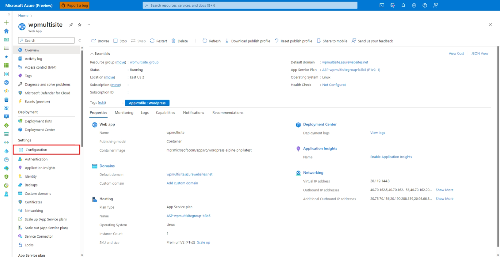

# How to enable Multisite WordPress on Azure App Service?

WordPress Multisite is an advanced feature of the popular WordPress content management system that allows website administrators to create and manage a network of multiple interconnected websites, also known as a "network of sites," from a single central installation of WordPress. 
At its core, WordPress Multisite is a powerful tool that empowers organizations, corporations, educational institutions, and large-scale website owners with the ability to efficiently and flexibly manage multiple websites, each with its own unique content, design, and domain, all within a unified and cohesive system.

The structure of a WordPress Multisite network is hierarchical in nature, with a single "Super Admin" overseeing the entire network and maintaining control over global settings, available themes, plugins, and user management. One of the significant advantages of WordPress Multi-Site is the ability to share resources across the network. Plugins, themes, and other core files can be shared across all the sites, reducing the need for duplication.This Super Admin has the authority to create new sites within the network and delegate administrative privileges to other users, allowing for granular control and centralized management of the entire ecosystem.

Each individual site within the multisite network has its own site administrator. Site administrators have control over their respective sites, allowing them to customise the site, activate or deactivate available plugins and themes, and manage user access and content. One of the most notable features of WordPress Multisite is the capability of domain mapping, where each site within the network can be associated with its own distinct domain name. This allows organizations to present a unified brand identity while still offering a personalized experience for each site's visitors, enhancing user engagement and fostering a sense of individuality for the different components of the network.

Create a WordPress site from [Azure Market place](https://ms.portal.azure.com/#create/WordPress.WordPress). You can follow this documentation to create a new WordPress site: [How to set up a new WordPress website on Azure App Service](https://techcommunity.microsoft.com/t5/apps-on-azure-blog/how-to-set-up-a-new-wordpress-website-on-azure-app-service/ba-p/3729150)

## Types of Multisites
### Subdirectory-based multisite
In a subdirectory-based multisite configuration, additional sites are organised as subdirectories within the main domain. For instance, if the main domain is _contoso.com_, the sub-sites would be structured as _contoso.com/site1_, _contoso.com/site2_, and so on.
Follow these steps to configure subdirectory based multisite: 
Naivgate to your App Service dashboard in Azure Portal, click on Configuration -> Application Settings, add the following settings and save them. This would restart your App Service and install multi-site WordPress.

   |Application Settings | Value |
   |---------------------|-------|
   | WORDPRESS_MULTISITE_CONVERT | true     |
   | WORDPRESS_MULTISITE_TYPE | subdirectory |
   | CUSTOM_DOMAIN | <custom_domain>   |

Custom domian integration is an optional configuration for subdirectory based multisite. Your can run the website under default domian that gets created as part of WordPress site creation or Azure Front Door endpoint if the site is integrated with Azure Front Door. 

If you plan to configure your website with custom domain then follow these steps: [Map existing custom DNS name - Azure App Service](https://learn.microsoft.com/en-us/azure/app-service/app-service-web-tutorial-custom-domain?tabs=root%2Cazurecli) 

### Subdomain-based multisite
In a subdomain-based multisite configuration, additional sites are structured as subdomains of the main domain. For instance, if the main domain is _contoso.com_, the individual sub-sites would be set up as _site1.contoso.com_, _site2.contoso.com_, and so on. 

* Map your custom domain to the App Service using the following steps: [Map existing custom DNS name - Azure App Service](https://learn.microsoft.com/en-us/azure/app-service/app-service-web-tutorial-custom-domain?tabs=root%2Cazurecli).
  
* If you have integrated your website with Azure Front Door, then you must map custom domain to Azure Front Door by following these steps: [How to add a custom domain - Azure Front Door](https://learn.microsoft.com/en-us/azure/frontdoor/standard-premium/how-to-add-custom-domain)

* Now, go to your App Service dashboard in Azure Portal, click on Configuration -> Application Settings, and add the following settings and save them. This would restart your App Service and install multi-site WordPress.

   |Application Settings | Value |
   |---------------------|-------|
   | WORDPRESS_MULTISITE_CONVERT | true     |
   | WORDPRESS_MULTISITE_TYPE | subdomain   |
   | CUSTOM_DOMAIN | <custom_domain>   |

### Important Notes
* A custom domain is mandatory for subdomain-based multi-site installations. 

* Do not add **https://** or **http://** prefix when adding the custom domain value for your App Setting. It should be just your domain name (ex: _contoso.com_).

* In the case of subdomain multisite, you can either integrate a wild card domain or required individual subdomains with your resource. Here, the resource can be either the App Service or an Azure Front Door. However, please note that in the CUSTOM_DOMAIN Application Setting, you should always pass the primary domain name (non-wild card).

* You can access your site only with the domain that is used for multi-site installation. Trying to access it via another domain might result in _"Error while establishing database connection"_ or _"too many redirections"_ errors. For instance, if you have used a custom domain (ex: _contoso.com_) to install the multi-site, and then try to access it via the default App Service domain (ex: _contoso.azurewebsites.net_), it might not work.

* In order to change the domain associated with the multi-site post installation, you might have to manually update the occurrence of the old domain name in the MySQL database tables. Some common tables to look for are *wp_options, wp_site, wp-blog, wp_users, wp_usermeta, wp_sitemeta* and so on. Moreover, there can be specific sub-site tables *(wp_2_site, wp_2_options etc.,)*.

 

